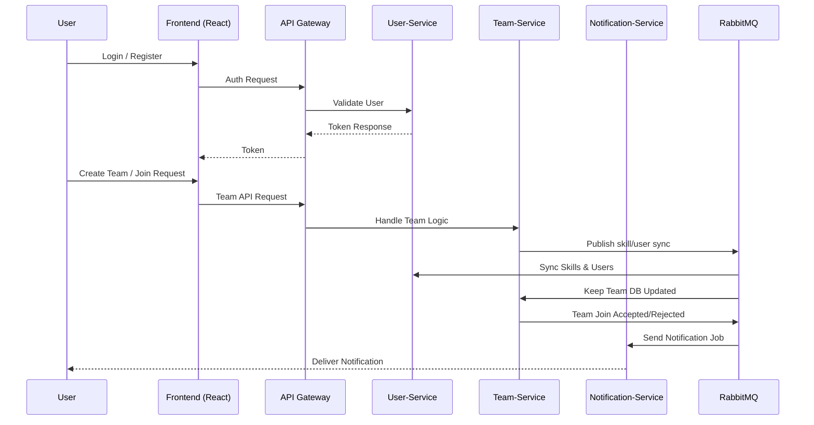

# HackMate

HackMate is a platform designed to help developers **create and find hackathon teams** based on skill requirements.  
It focuses on seamless team formation, skill matching, and real-time notifications — built with a **backend-heavy microservices architecture** and a robust DevOps pipeline.

---

## 🚀 Features

- **User Management**: Register, login, and manage skills.
- **Team Management**: Create teams, define required skills, accept or reject join requests.
- **Skill Matching**: Users can view team listings, compare skill requirements, and apply to join.
- **Notifications**: Real-time notifications when members are added or requests are accepted/rejected.

---

## 🏗️ Architecture Overview

HackMate follows a **microservices architecture** with 3 core services:

1. **User Service**  
   - Handles registration, login, and skill management.  
   - Acts as the **source of truth** for users and skills.  

2. **Team Service**  
   - Handles creation of teams, join requests, and membership management.  
   - Maintains a local copy of users and skills via **RabbitMQ events** to decouple services.  

3. **Notification Service**  
   - Delivers notifications when team join requests are accepted or rejected.  
   - Example: If a new member joins, all existing members are notified.  

---

---

### 📐 System Architecture Diagram

---

## ⚙️ Workflows

1. **Team Creation**  
   - A logged-in user creates a team with project details and required skills.  

2. **Joining Teams**  
   - Other users browse open teams, view members, compare skills, and request to join.  

3. **Approval & Notification**  
   - Team leader accepts/rejects requests.  
   - Notifications are sent to all team members and the requester through the **notification service**.

---

## 🔑 Backend Highlights

- **Microservices**: User Service, Team Service, Notification Service.  
- **Message Queue**: RabbitMQ ensures decoupling and async communication.  
- **Database Strategy**:  
  - User & skills live in **User Service** (source of truth).  
  - Replicated to **Team Service DB** via events for faster reads.  
- **Event-Driven Notifications**: Accepted/rejected join requests trigger RabbitMQ messages consumed by Notification Service.

---

## ☁️ DevOps & Infrastructure

HackMate’s strength lies in its **backend infrastructure and DevOps automation**:

- **Hosting**: Deployed on **AWS**.  
- **CI/CD Pipeline**:  
  - Implemented with **GitHub Actions**.  
  - Builds Docker images and pushes to Docker Hub.  
  - Automates deployment to EC2 via **Ansible**.
- **Infrastructure as Code**: Managed entirely with **Terraform**.  
- **Networking**:  
  - Custom VPC with **public subnets for EC2** and **private subnet for RDS**.  
  - Bastion host used to securely access RDS databases.  
- **Databases**: Each service uses its own database in **Amazon RDS**.  
- **API Gateway**: **Amazon API Gateway (HTTP API)** proxies requests to different services.  
- **Configuration Management**:  
  - **Ansible** pulls Docker images from Docker Hub and runs them on EC2.  
  - Separate playbooks handle database and user setup in RDS.  
- **Containers**:  
  - Each service runs inside Docker containers.  
  - A dedicated EC2 instance runs **RabbitMQ**.

---

## 🌐 Frontend

Although backend-heavy, HackMate includes a simple frontend for user interaction:

- **Stack**: React + TypeScript + TailwindCSS + AuthContext.  
- **Hosting**: Deployed on **Vercel**.  

---

## 📦 Tech Stack Summary

- **Backend**: Django, RabbitMQ, Docker, AWS EC2, RDS.  
- **DevOps**: Terraform, Ansible, GitHub Actions, API Gateway.  
- **Frontend**: React, TypeScript, TailwindCSS, Vercel.  

---

## 📌 Key Takeaways

HackMate is primarily a **DevOps and backend-focused project** demonstrating:  
- Microservices with async communication.  
- Event-driven architecture with RabbitMQ.  
- Full CI/CD automation with GitHub Actions.  
- Complete IaC setup using Terraform + Ansible.  
- Production-ready deployment on AWS with secure networking.  

---

## Sequence Diagram

sequenceDiagram
    participant U as User
    participant API as API Gateway
    participant US as User Service
    participant TS as Team Service
    participant MQ as RabbitMQ
    participant NS as Notification Service

    U->>API: POST /team/join
    API->>TS: Forward request
    TS->>US: Fetch user & skills (async copy from events)
    TS-->>U: Request submitted

    alt Leader accepts request
        TS->>MQ: Publish "Join Accepted" event
        MQ->>NS: Deliver event
        NS->>U: Notify new member
        NS->>Team: Notify all existing members
    else Leader rejects request
        TS->>MQ: Publish "Join Rejected" event
        MQ->>NS: Deliver event
        NS->>U: Notify rejection
    end
